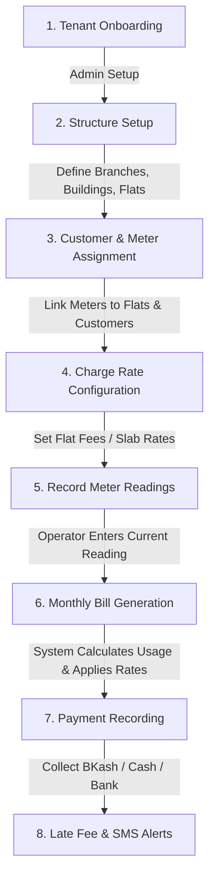
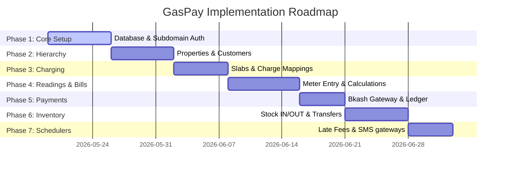

# GasPay Project Workflow & Implementation Plan

Welcome to the **GasPay** implementation plan! This document breaks down the entire project’s architecture, database schema (ERD), and product requirements (PRD) into the simplest, most intuitive terms. It provides a visual workflow diagram and a step-by-step roadmap to guide you from start to finish.

---

## 1. The Easiest Project Workflow Explanation

Think of **GasPay** as a SaaS utility platform. The entire system is built around a single core goal: **helping gas companies measure consumption, configure complex pricing rates, generate monthly bills, and collect payments.**

Here is the exact lifecycle of how a gas utility tenant operates on the platform:



### An End-to-End Story (How it works in practice)
1. **Onboarding**: A gas company (e.g., *Metropolitan Gas Co.*) registers on **GasPay** and gets a subdomain like `metro.gaspay.cc`.
2. **Setup Property Hierarchy**: They add their properties:
   - **Branch**: *Dhaka Branch*
   - **Building**: *Rose Valley Heights* (10 floors, 40 flats)
   - **Flats**: *Flat 3A, Flat 3B...*
3. **Map Customers & Equipment**: 
   - They register a customer (*Mr. Rahman*) as the Renter of *Flat 3A*.
   - They install physical Gas Meter `M-98765` inside *Flat 3A*.
4. **Configure Charges (Pricing Engine)**: They configure rules for *Rose Valley Heights*:
   - A **Fixed** monthly service charge of **$500**.
   - A **Unit** slab charge for gas consumption:
     - 0 to 100 units $\rightarrow$ **$120 / unit**
     - 101+ units $\rightarrow$ **$180 / unit**
   - A **Percentage** VAT of **5%** on the total bill.
5. **Collect Readings**: At the end of May, a meter reader visits Flat 3A:
   - Previous reading: **100 units** (carried over automatically)
   - Current reading: **180 units**
   - Consumption calculated automatically: $180 - 100 = 80$ units.
6. **Generate Bills**: The tenant admin clicks "Generate May Bills" for *Rose Valley Heights*:
   - The billing engine fetches the $80$ units consumption for Flat 3A.
   - It calculates charges step-by-step:
     1. **Gas Bill**: $80 \text{ units} \times \$120 = \$9,600$ (fits slab 1).
     2. **Service Charge**: $\$500$ (fixed).
     3. **VAT (5%)**: $(\$9,600 + \$500) \times 0.05 = \$505$.
     4. **Total Payable**: $\$9,600 + \$500 + \$505 = \$10,605$.
7. **Record Payment**: *Mr. Rahman* receives an SMS notification with a link to his bill. He pays **$10,605** via bKash. The platform records the transaction, updates the bill status to **PAID**, and sends a confirmation SMS.

---

## 2. Visual Workflow Diagram

Below is the high-quality conceptual workflow and architecture diagram generated for **GasPay**:


---

## 3. Database Schema (ERD) Deep Dive

Our database file `Gaspay.sql` details a clean, relational multi-tenant schema. Let's group the tables into logical domains to understand their roles:

### 3.1 Tenant & Security Core
* **`subscription_plans`**: Defines packages (Monthly/Yearly pricing, max branches/buildings/flats limits).
* **`tenants`**: Represents the gas companies. Every tenant is linked to a subscription plan.
* **`roles` & `permissions` & `role_permissions`**: Stores the permissions templates (e.g., *Operator*, *Meter Reader*, *Super Admin*).
* **`users`**: Central account credentials. Multi-tenant secure.
  > [!IMPORTANT]
  > When a user is created, their role permissions are copied into the user's `permissions_json` column. This enables **user-specific overrides** (adding/removing specific access from a user without altering the global role). Changes to the role later do NOT affect existing users unless re-assigned.

### 3.2 Property & Customer Hierarchy
* **`branches` $\rightarrow$ `buildings` $\rightarrow$ `flats`**: 3-level geographical hierarchy.
* **`customers`**: Stores resident information (phone, email, status).
* **`customer_flat_mappings`**: Connects customers to flats.
  > [!NOTE]
  > **Core Rule**: A flat can have only **one active customer** at a time (ownership type: Owner, Renter, Family). However, **one customer** can own or rent **multiple flats**.

### 3.3 Meters & Readings
* **`meters`**: Physical hardware linked to a specific flat.
* **`meter_readings`**: Holds monthly readings.
  * `consumption` = `current_reading` - `previous_reading`
  * Status options: `average`, `high`, `complain` (validation flags).

### 3.4 The Pricing & Billing Engine
This is the most critical and complex part of the ERD:
* **`charge_types`**: The kind of charge (UNIT, FIXED, PERCENTAGE) and what it applies on (Consumption, Subtotal, or Total).
* **`charge_configs`**: Holds active pricing values (e.g. $150 per unit, 5% VAT) and the effective date range (`effective_from` to `effective_to`).
  > [!IMPORTANT]
  > A building can only have **one active charge of the same type** at a time.
* **`charge_config_mappings`**: Restricts a charge configuration to specific buildings.
* **`charge_slabs`**: Links to `charge_configs` to support tiered/slab billing (e.g., 0-50 units at rate A, 51-100 units at rate B).
* **`bills` & `bill_items`**: `bills` holds the summary (total usage, bill number, grace period, due date, status). `bill_items` stores the itemized lines (VAT, gas fee, service charge) for auditor-level transparency.

### 3.5 Payments & Financial Ledger
* **`payments`**: Captures cash, bKash, or bank transfers against a bill.
* **`transactions`**: General ledger record for bookkeeping.

### 3.6 Inventory & Distribution
* **`suppliers` & `materials` & `material_purchases`**: Manages the hardware supply chain (purchase of cylinders, pipes, regulators).
* **`stores`**: Warehouses.
* **`inventory_stock` & `inventory_transactions`**: Logs every cylinder or meter movement between stores, branches, and buildings.

---

## 4. Phase-by-Phase Project Roadmap (What to do first!)

This phase-by-step roadmap lists what you should build next, ensuring dependencies are resolved in the correct order.



### Phase 1: Database Setup, Subdomains & Auth
* [ ] **Prisma Schema initialization**: Convert the `Gaspay.sql` schema to `schema.prisma`. Set up indices, soft deletes (`isDeleted` flags), and relation cascades.
* [ ] **Subdomain multi-tenancy middleware**: Implement subdomain extraction in NestJS to identify `tenant_id` from the URL host (e.g., `tenant1.gaspay.cc`).
* [ ] **Security Layer**: Create JWT-based Auth with Access + Refresh tokens.
* [ ] **Roles & Custom Permissions**: Implement the template copying system (when creating a user, pull permissions from role template and write to `permissions_json`). Allow direct custom override edits.

### Phase 2: Structural & Customer Configuration
* [ ] **Hierarchy API & UI**: CRUD screens for Branches, Buildings, and Flats.
* [ ] **Customer Profile Panel**: Customer CRUD and Flat mapping (1-to-1 active flat limit check, ownership types: owner/renter).
* [ ] **Meters Inventory**: Create meter records and map them to empty flats.

### Phase 3: Highly Flexible Charging Engine
* [ ] **Charge Types & Configs**: Setup forms to define Charges (Fixed, Percentage, Slab-based Unit charge).
* [ ] **Building-wise Mapping logic**: Implement mapping validators (prevent overlapping date ranges or duplicate active charges of same type in a single building).
* [ ] **Slab Configuration Module**: Setup slab intervals (e.g., Slab 1: 0-50, Slab 2: 51-100, Slab 3: 101+).

### Phase 4: Readings & Bill Generation Engine
* [ ] **Meter Reading Interface**: Mobile-friendly reading entries. Automate validation (prevent `current_reading < previous_reading` or duplicate monthly entries).
* [ ] **The Calculation Engine**: Implement the core math service that computes slab charges, sub-total percentage charges, and rounds values.
* [ ] **Bulk Bill Generation**: Tenant admins can filter by Building, review consumption, preview the calculated totals, and run batch bill creation.
* [ ] **Super Admin Correction**: Special controller routes to edit/regenerate finalized bills (only for Super Admins).

### Phase 5: Payments & Financial Ledger
* [ ] **Payment Recording**: Standardize manual payment entries (Cash/Bank) and mock bKash checkout logic.
* [ ] **Financial Calculations**: Handle partial payments (decrease bill balance) and overpayments (store as tenant credit balance).
* [ ] **Transactions ledger**: Automate ledger entries upon payments.

### Phase 6: Inventory & Stock Movement
* [ ] **Supply Chain CRUD**: Supplier, Materials, and Purchase invoices tracking. Calculate `effective_unit_cost` automatically.
* [ ] **Store Management**: Central warehouses setup.
* [ ] **Transactions Log**: Material stock-in to store, stock-out (issuing to a building), or store-to-store transfers.

### Phase 7: Gateways & Background Workers
* [ ] **Late Fee Schedulers**: Set up NestJS Cron jobs (`@nestjs/schedule`) to run nightly, check bills past `due_date` + `grace_days`, and apply configured fixed or percentage late fees.
* [ ] **SMS Queue Service**: Implement an asynchronous Redis queue (or database-backed queue) for transactional SMS alerts (billing invoice links, payment confirmations) with failure retries.
* [ ] **PDF Invoices Builder**: Render beautiful PDF bills for emails and downloads.

---

## 5. Verification Plan

### 5.1 Automated Billing Formula Tests
To ensure the math engine is 100% accurate, run unit tests validating the Charging Test cases:
```typescript
describe('Billing Calculation Engine', () => {
  it('should compute slab consumption accurately (CHG-005)', () => {
    const usage = 180;
    const slabs = [
      { from: 0, to: 100, rate: 120 },
      { from: 101, to: null, rate: 180 }
    ];
    const billAmount = calculateSlabs(usage, slabs);
    expect(billAmount).toBe((100 * 120) + (80 * 180)); // 26400
  });

  it('should prevent overlapping charge configs for same type in building', async () => {
    await expect(saveChargeConfig(overlapConfig)).rejects.toThrow();
  });
});
```

### 5.2 Manual Verification
* **Multi-Tenancy**: Open two browsers, sign into `tenantA.gaspay.cc` and `tenantB.gaspay.cc`, and confirm that Tenant A's buildings are invisible to Tenant B.
* **Role Overrides**: Edit a user's permissions, deactivate their "can_generate_bill" flag while their role still has it, and verify they receive a `403 Forbidden` response.
